# 🚍 Gadaa Bus Public Transit Scheduling System

A web-based **public transportation management system** developed for the Gadaa Bus service in Ethiopia. The system improves bus scheduling, ticket booking, route management, and passenger communication through a centralized digital platform.

---

# 🎯 Project Objective

The main objective of this system is to modernize the public transportation process by:

- Improving bus scheduling efficiency  
- Enabling online ticket booking and cancellation  
- Providing real-time passenger notifications  
- Enhancing route and driver management  
- Supporting data-driven decision making for administrators  

---

# 🛠️ Technologies Used

- PHP (Backend)
- MySQL (Database)
- HTML, CSS (Frontend)
- JavaScript (Interactivity)
- XAMPP (Local Server)
- Git & GitHub (Version Control)

---

# ✨ System Features

## 👤 Passenger Module
- User registration and login
- View bus schedules and routes
- Book tickets online
- Cancel tickets
- View booking history
- Receive notifications and announcements
- Submit feedback

---

## 🛡️ Admin Module
- Manage routes and schedules
- Manage passengers and drivers
- View bookings and cancellations
- Create announcements
- Send notifications
- Generate reports
- Monitor system activity

---

# 🗄️ Database Overview

The system includes the following core tables:

- Users  
- Routes  
- Schedule  
- Bookings  
- Cancellations  
- Drivers  
- Notifications  
- Announcements  
- Reports  
- Feedback  

---

# 📸 System Screenshots

## Home Page
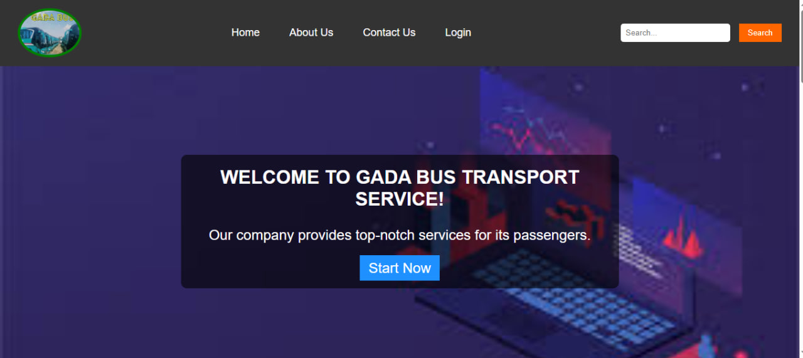

## 🔐 Login Page
> Add screenshot below

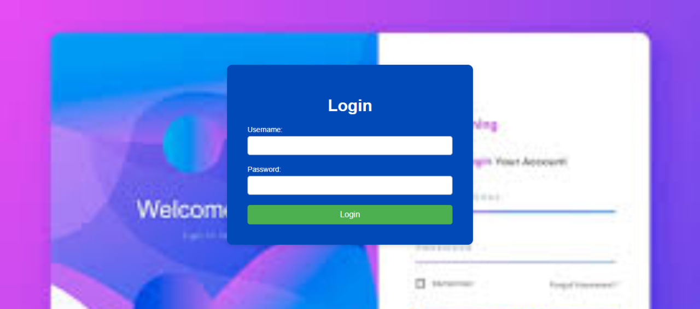

---

## 📝 Registration Page
> Add screenshot below

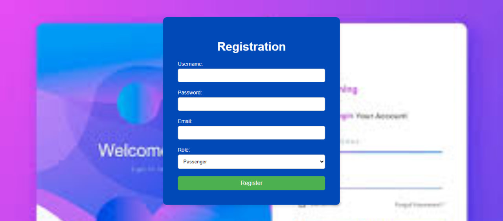

---

## 🎫 Passenger Dashboard Page
> Add screenshot below

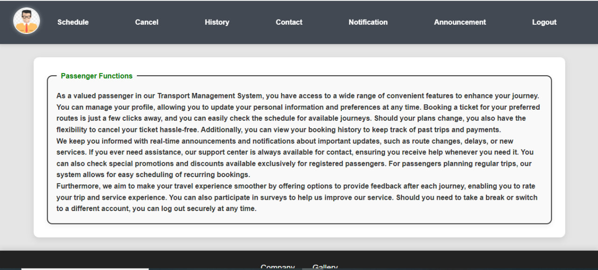

---

## 🎫 Ticket Booking Page
> Add screenshot below

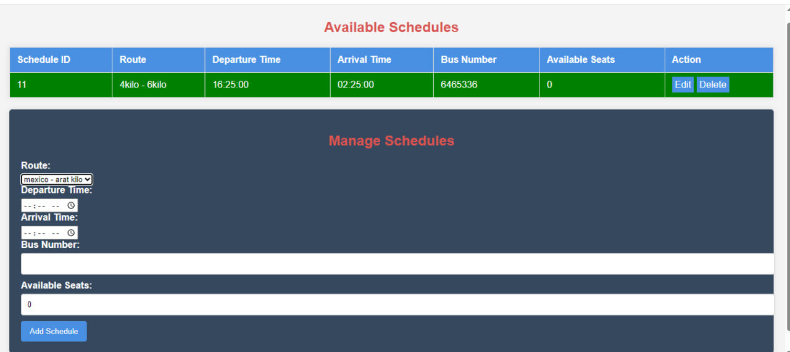

---


## 📅 Schedule Management
> Add screenshot below


---

## 📢 Notifications
> Add screenshot below

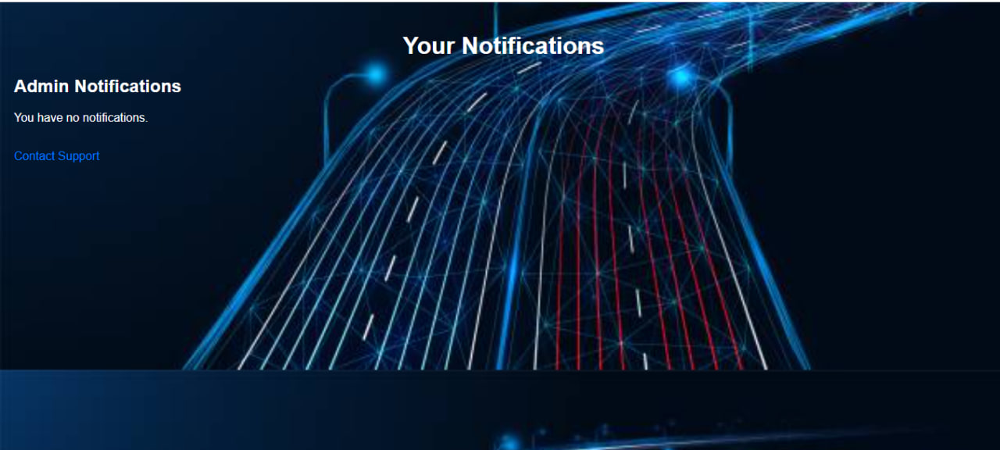

---

## 📢 Announcements
> Add screenshot below

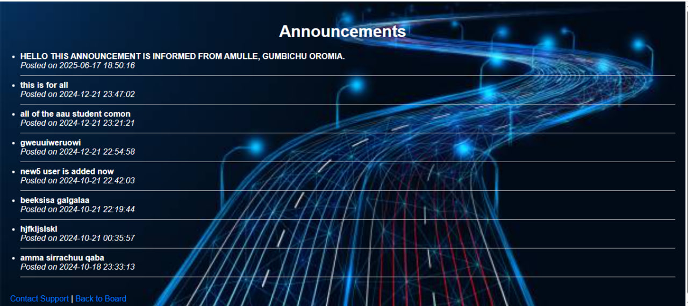

---

## 📢 Support Page
> Add screenshot below

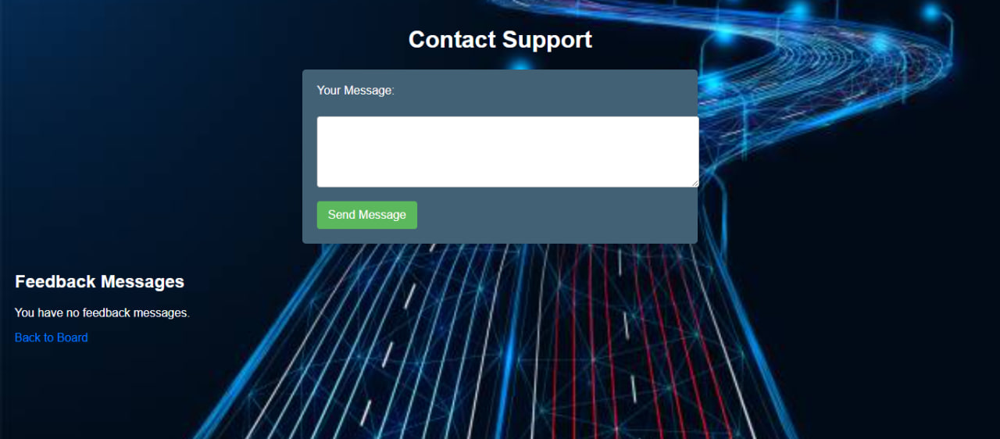

---

## 🎫 Admin Dashboard Page
> Add screenshot below

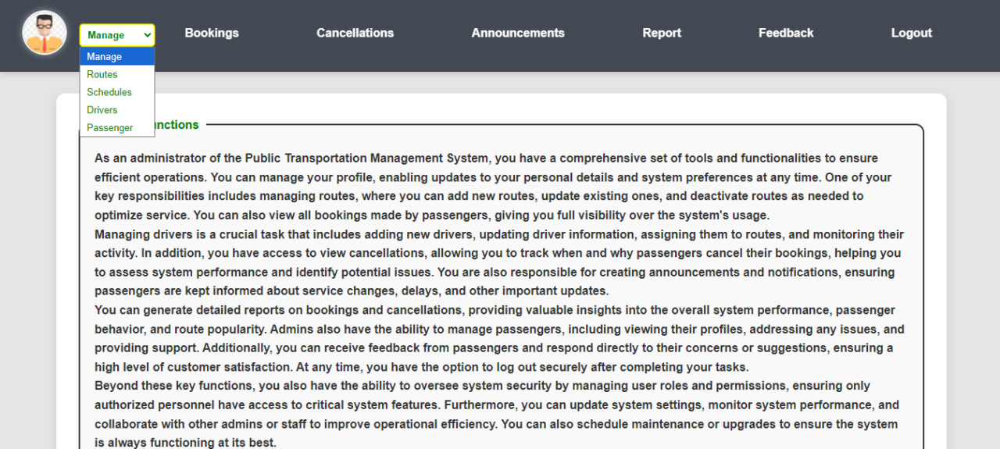

---

## 🛣️ Route Management (Admin)
> Add screenshot below

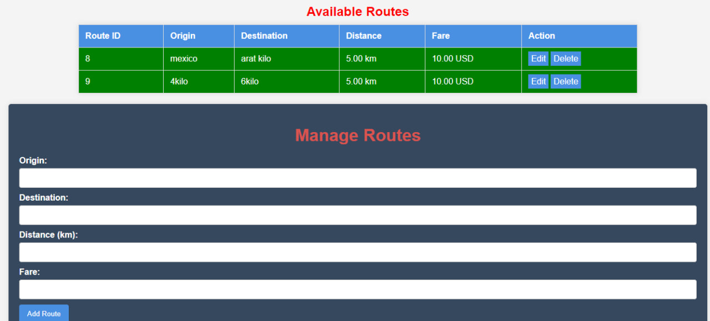

---

## 🛣️ Schedule Management (Admin)
> Add screenshot below


---

## 📊 Reports Dashboard
> Add screenshot below

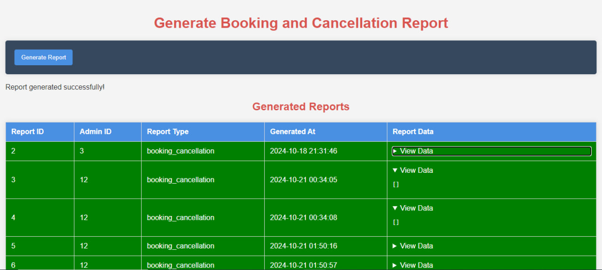

---

# ⚙️ Installation Guide (Local Setup)

### 1. Clone Repository
```bash
git clone https://github.com/your-username/gadaa-bus-system.git

# ⚙️ Installation Guide (Local Setup)Follow the steps below to run the Gadaa Bus System on a local machine.---## 1. Clone the Repository```bashgit clone https://github.com/your-username/gadaa-bus-system.git

### 2. Move Project to Server Directory
After cloning or downloading, move the project folder into the XAMPP htdocs directory:
C:\xampp\htdocs\gadaa-bus-system

### 3. Start Local Server
Open XAMPP Control Panel and start the following services:


Apache


MySQL


### 4. Create Database
Open your browser and go to:
http://localhost/phpmyadmin
Then create a new database:
gadaa_bus_db

### 5. Import Database
Inside phpMyAdmin:


Select the created database (gadaa_bus_db)


Click Import


Choose the provided .sql file from the project


Click Go to import tables and data


### 6. Run the Project
Open your browser and access the system using:
http://localhost/gadaa-bus-system

### 7. Login and Use the System


Register as a passenger or login as admin


Start using features such as booking, scheduling, and management


Author: Degefa Lemma.
Gmail : dagefalemma@gmail.com


